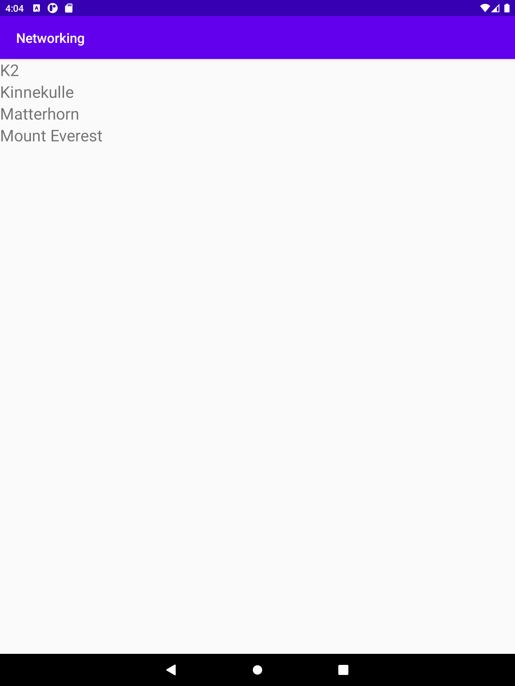

# Rapport
La till rätt URL i JSON_URL variabeln och enablade internet access. Nu sparas urlen i rätt variabel som kallas när execute JSON task körs.
La till hårdkodade strängar för att populera listan. Den byttes sen ut med datan från nätet. Här gjordes även adaptern.
I nästa commit bytte jag ut den hårdkodade listan av strängar mot en Array list
```
List<String> mountains = Arrays.asList("K2", "Mount Everest", "Mount Blanc", "Olympus");
```
blev till
```
ArrayList <String> Mountain = new ArrayList<String>();
```
Arraylisten skapas i mainActivity och populeras av JSON genom en lista som görs till en Arraylist av typen Mountain
Bilder läggs i samma mapp som markdown-filen.
Recyclerview använder samma adapter som mountain genom
```
recyclerView.setAdapter(adapterMountain)
```
Viewholdern var från början skapad i adaptern men flyttades till en egen separat klass för att underlätta felsökning och struktur
Skapade setters för adaptern att hämta mountain names, metoder finns för att hämta location och size men används inte



